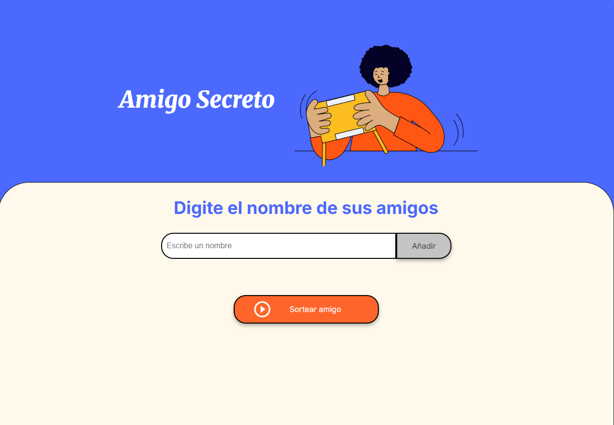

# Proyecto de mi primer Challenge: Amigo secreto

Este desafío es el primero del Programa ONE

## ¿De qué trata?

Trata de que puedes ingresar nombres de amigos en una lista para que se realice un sorteo aleatorio y determina quién es tu amigo secreto.

## Fucionalidades:

* Agregar nombres: Los usuarios escribirán el nombre de un amigo en un campo de texto y lo agregarán a una lista visible al hacer clic en "Adicionar".
* Agregar nombres: Los usuarios escribirán el nombre de un amigo en un campo de texto y lo agregarán a una lista visible al hacer clic en "Adicionar".
* Validar entrada: Si el campo de texto está vacío, el programa mostrará una alerta pidiendo un nombre válido.
* Visualizar la lista: Los nombres ingresados aparecerán en una lista debajo del campo de entrada.
* Sorteo aleatorio: Al hacer clic en el botón "Sortear Amigo", se seleccionará aleatoriamente un nombre de la lista y se mostrará en la página.

## ¿Cómo se ve el programa?

## ¿Qué me costó más realizar?

EL visualizar el listado y por último el sorteo aleatorio, pero se logró.
